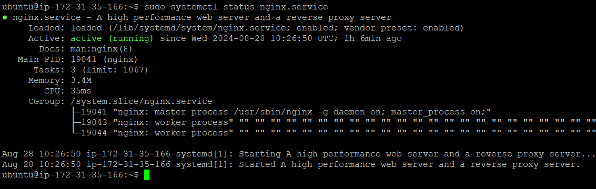
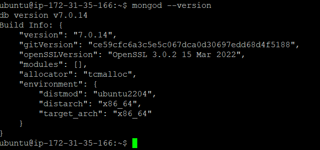
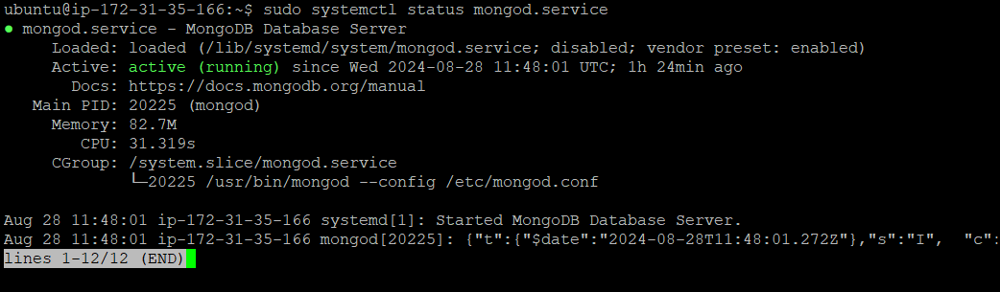

# Installation

## NGINX


### Prerequisites
 **Update the system packages**<br>
`sudo apt update`<br>
 `sudo apt upgrade -y` 
 <br>`-y` option is given so there wont be another prompt by the shell  asking for permission either yes or no, implicitly gives yes.
### Proceed with Installation of NGINX
`sudo apt install nginx -y` 
### start, enable and check status
1. starting the service
`sudo systemctl start nginx`
2. enabling the service 
`sudo systemctl enable nginx` #this starts nginx always on systemboot automatically.
3. checking the status 
`sudo systemctl status nginx`

### output of the `sudo systemctl status nginx` command

## MongoDB
 ### Install prerequired packages for the installation process<br>
` sudo apt install software-properties-common gnupg apt-transport-https ca-certificates -y`
### Install public key to add mongodb repository to your systems source file<br>
```curl -fsSL https://pgp.mongodb.com/server-7.0.asc |  sudo gpg -o /usr/share/keyrings/mongodb-server-7.0.gpg --dearmor```
### Add MongoDB 7.0 APT repository to the /etc/apt/sources.list.d directory.
```echo "deb [ arch=amd64,arm64 signed-by=/usr/share/keyrings/mongodb-server-7.0.gpg ] https://repo.mongodb.org/apt/ubuntu jammy/mongodb-org/7.0 multiverse" | sudo tee /etc/apt/sources.list.d/mongodb-org-7.0.list```
### Install mongodb-org package (meta-package) that provides mongodb
`sudo apt install mongodb-org -y`
### Verify installation process
`mongod --version`
### Output of `mongod --version`

### Start the mongodb service
`sudo systemctl start mongod`
### Status to verify mongodb service
`sudo systemctl status mongod`
### Output of `sudo systemctl status mongod`


